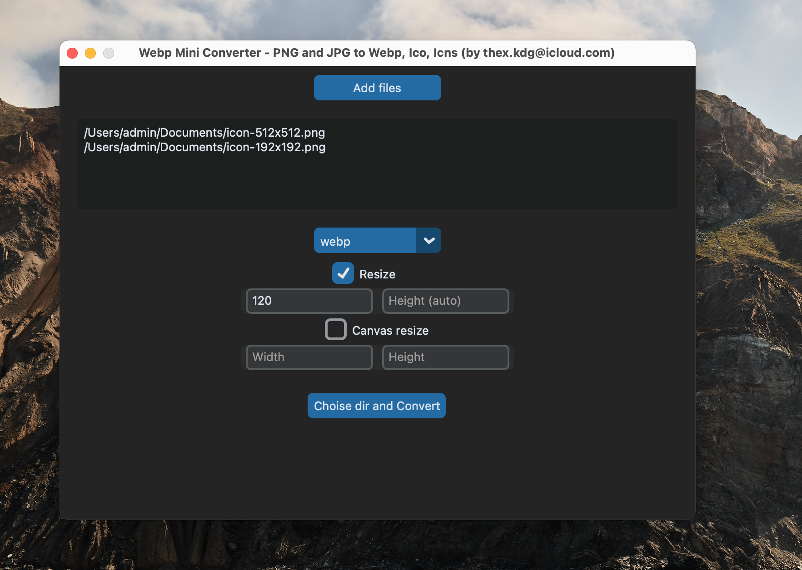

# 🛠 Webp Mini Converter — Minimalist Utility for macOS

A simple desktop app built with Python, pillow, customtkinter and PyInstaller, packed into a `.dmg`.  
Clean, fast, and offline. No tracking. No ads. Just useful.

## 🚀 Features

- Convert your jpg, png files to webp, ico, icns (macOS app icons)
- Lightweight .app file (macOS)
- Multiple files Upload for convert
- Resize picture with only width parametr, or width and height
- Resize canvas picture with only width parametr, or width and height 
- Minimalistic interface (no big menu, no problem ;-) )
- .dmg installer with drop-to-Applications
- MIT-licensed and open source
- No internet required to use

## 🧰 How to Use

1. Download the `.dmg` from [Releases](https://github.com/thexkdg/jpg_png_to_webp_and_icns/releases)
2. Drag `WebpMiniConverter.app` into Applications
3. Run it and enjoy!

## ☕ Like the app?

Send me a coffee in ETH: `0x9A5DfB9Ec517042D372403962547e5468A0f2dDa` 

## 📜 License

MIT — see [LICENSE](./LICENSE) file.

